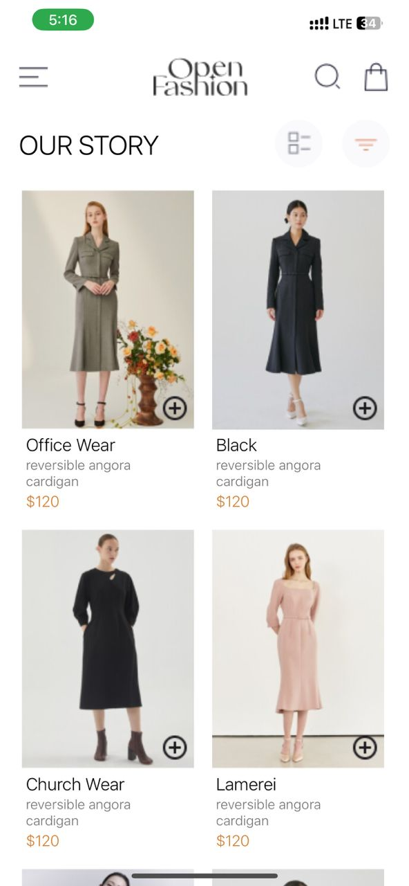

## Overview
This is a React Native project that recreates the design provided in the UI mockup for DCIT202 Mobile Application Development Assignment 6. The application includes a product list, a cart, and functionality to add and remove products from the cart. Selected items are stored locally on the device.

## Features
- **HomeScreen:** Displays a list of available products.
- **CartScreen:** Displays selected items in the cart.
- **Add to cart button:** Allows users to add products to their cart.
- **Remove from cart button:** Allows users to remove products from their cart.

## Functionality
- View a list of available products.
- Add products to the cart.
- Remove products from the cart.
- View the items in the cart.

## Installation
1. Clone the repository:  
2. Install dependencies:
   ```bash
   npm install
   ```

## Running the App
- For iOS:
  ```bash
  npx react-native run-ios
  ```
- For Android:
  ```bash
  npx react-native run-android
  ```

## Design Choices
1. **UI Layout:** Followed the provided UI mockup closely to ensure the design is consistent with the assignment requirements.
2. **Component Structure:**
   - `HomeScreen`: Displays products fetched from a local JSON file.
   - `CartScreen`: Shows products added to the cart.
3. **Local Storage:** Used AsyncStorage to store selected items locally on the device. This allows persistence of cart data even when the app is closed.
4. **State Management:** Managed state using React's built-in `useState` and `useEffect` hooks for simplicity and ease of understanding.

## Implementation Details
1. **Product List:** Implemented as a flat list for efficient rendering of the product list.
2. **Add to Cart:** Button on each product item updates the state and AsyncStorage.
3. **Remove from Cart:** Button in the cart updates the state and AsyncStorage.
4. **Local Storage:** Used AsyncStorage for storing and retrieving cart items.

## Screenshots
Include screenshots of the app showing: 
!

[Cart](assets/cartscreenshot.jpg)